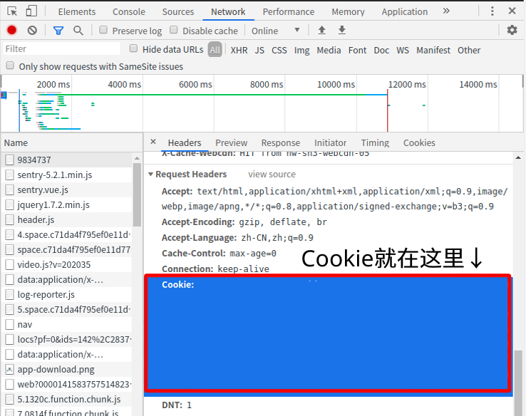
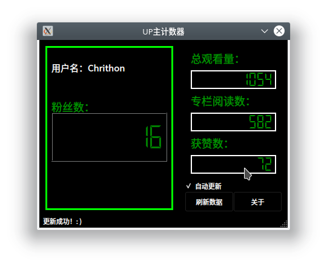

 # UP主计数器

 **使用前请先阅读以下内容**

## 使用教程

需要的包：Requests、PyQt5

1.将uid.conf文件的所有内容改成你的UID

2.将cookie.conf文件的所有内容改成你的Cookie（已登录的状态下，见图，按F12并点击Network即可）

3.从counter.py启动程序即可

请注意，如果需要退出程序，请先关闭自动更新，等待几秒后可以直接关闭窗口（主页面见下图）

当然你对外观不满意，你可以用Python和PyQt或者其他GUI框架自己制作一个界面。但是请务必不要删除或者修改counter_core.py文件，否则将无法获取UP主数据！（除非你是大师球）

## 接口

如果需要用自己的GUI，建议您先了解一下以下核心接口相关的内容：

在接入接口之前请先import counter_core

以下是接口用法：

get_username(UID,Cookie)

获取用户名

get_fans(Cookie)

获取粉丝数

get_views(UID,Cookie)

获取视频观看量

get_reads(UID,Cookie)

获取阅读量（专栏）

get_likes(UID,Cookie)

获取获赞量

当然，你还需要Qt 设计师来设计你的界面。如果你是大师球的话，你可以自己手打一个GUI程序，或者就像Visual Studio Code或者Electron一样，自己做个基于Html文件的计数器。

具体教程：https://www.bilibili.com/read/cv5110511

当然，如果你用其他编程语言写程序，也没关系！直接Fork并修改我的项目吧！（别把核心代码删了就行，除非你要从头开始写计数器核心）

## 其他语言接口

（暂时没有其他人，等你来补充！）

**只要你的想象够丰富，你的计数器绝对是独一无二的！**
